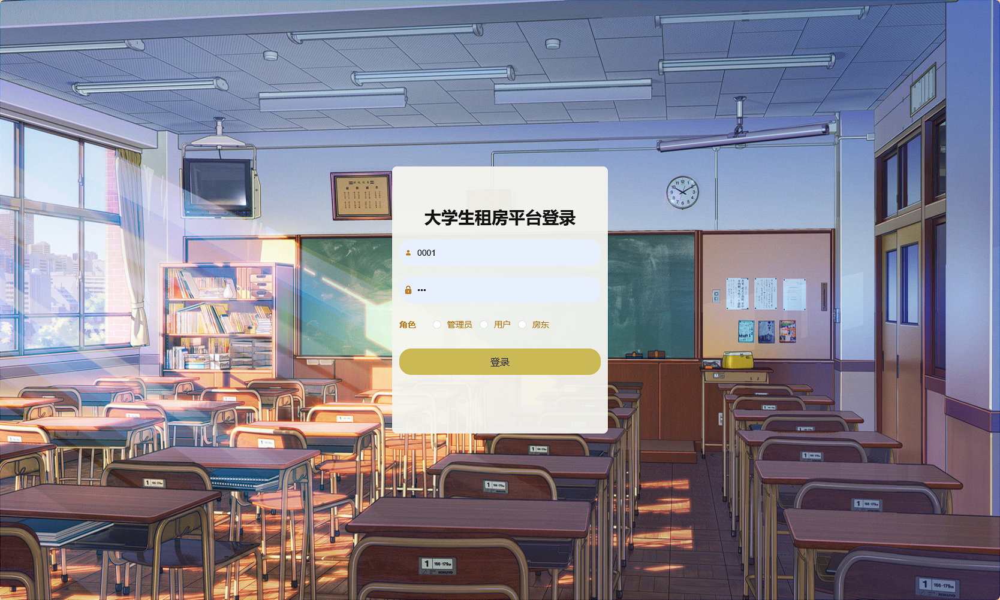
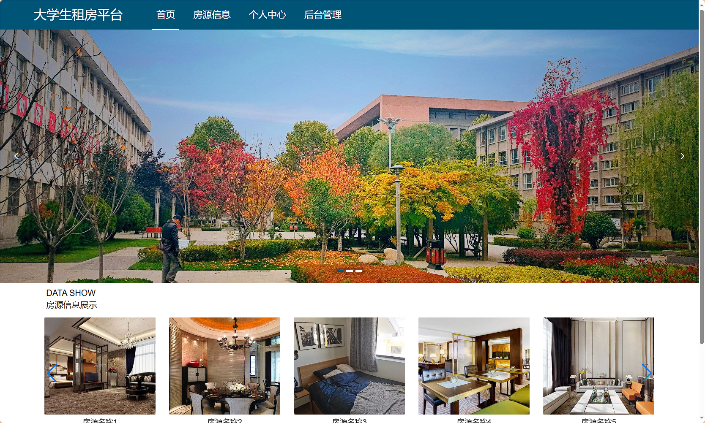
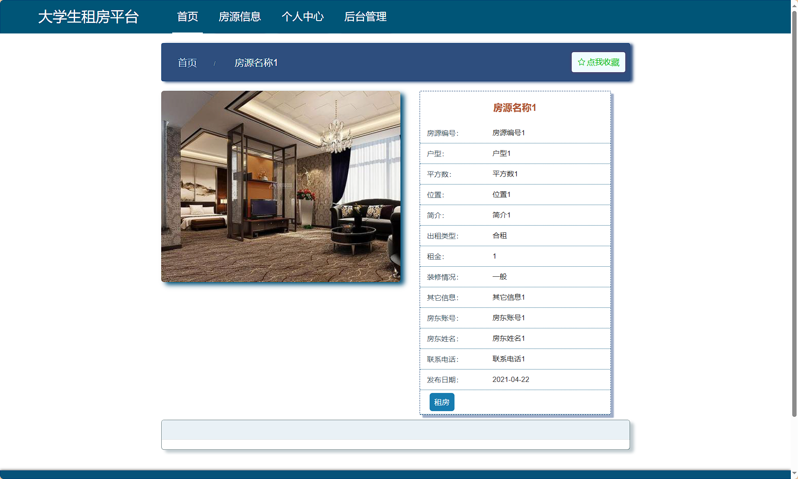
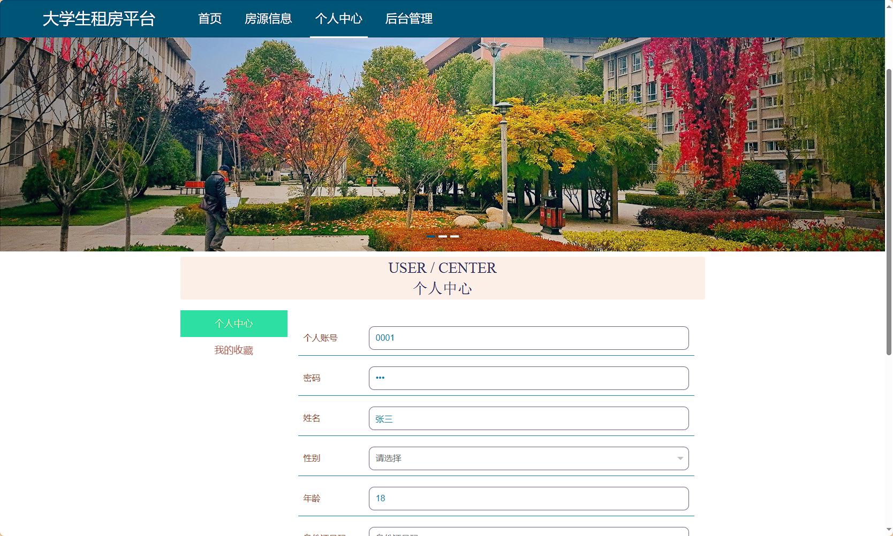
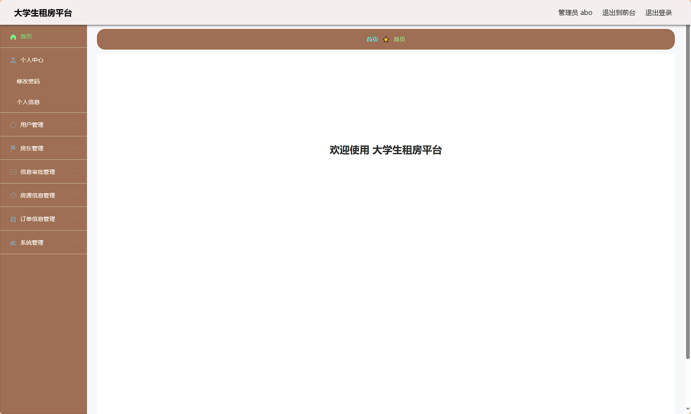
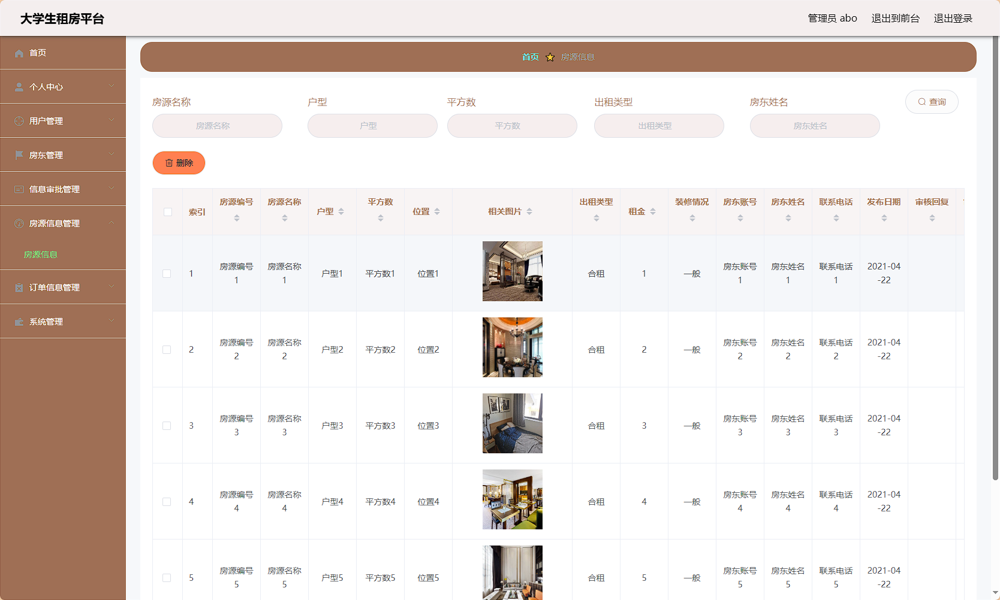
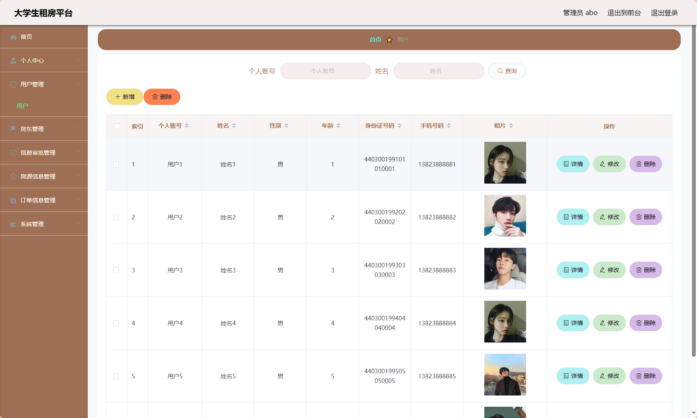
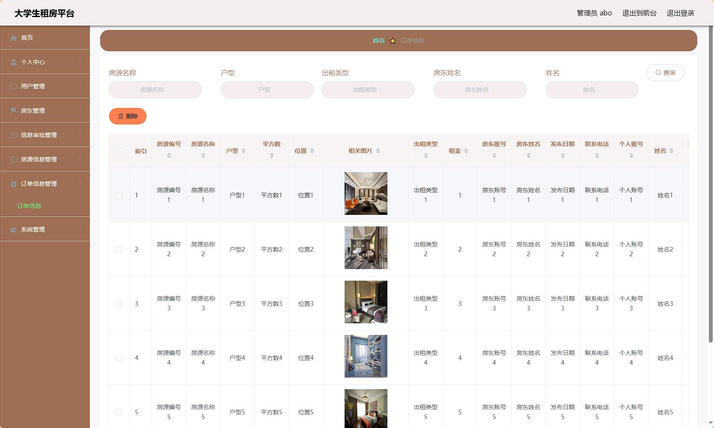
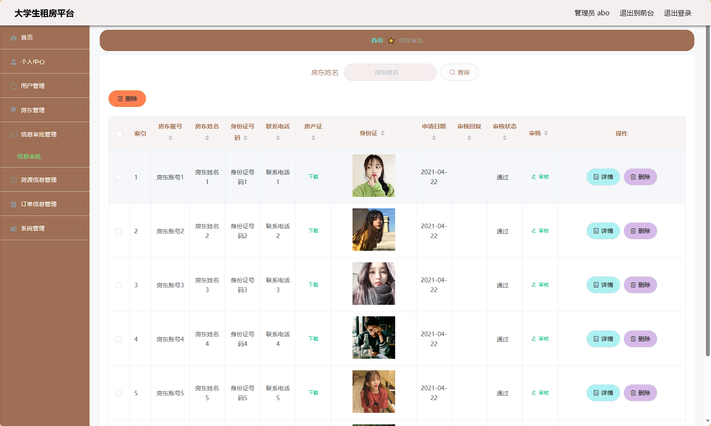
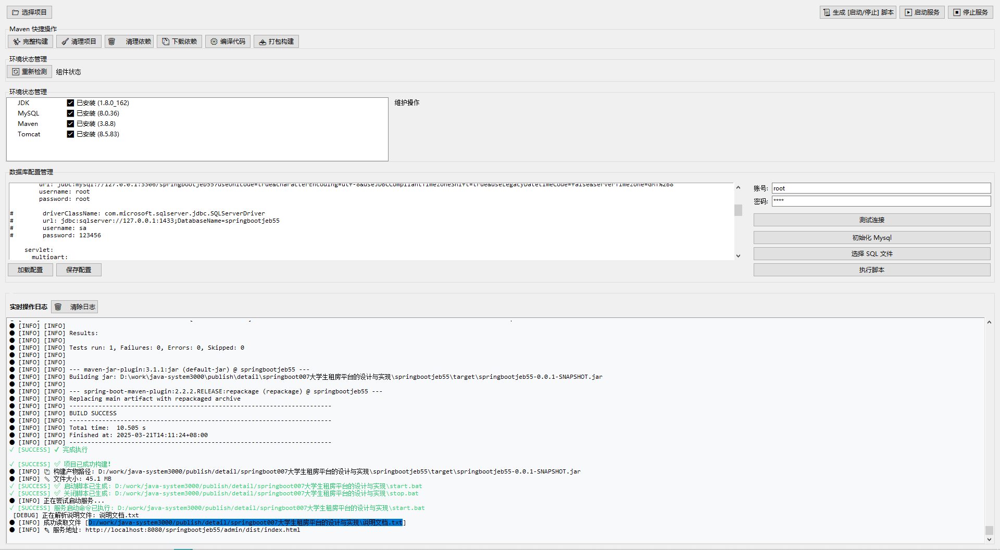

# 大学生租房平台系统 / Intelligent Leasing Management


> 更多毕设项目可跳转至项目导航栏检索：[毕设项目](http://sysadmin.3vfree.vip)，需要联系博主v：xq-lucky311，q：1047944234

# 项目简介  
基于 SpringBoot 2.7 + Vue 2.x 的全栈租房平台，采用 MySQL 实现数据存储，包含管理员、房东、用户三级权限体系，提供房源审核、在线租赁、订单支付等核心功能，专为高校学生租房场景设计的轻量化解决方案。

# 特征介绍  
- ​**分层权限控制**：采用 RBAC 模型实现管理员（系统管理）、房东（房源管理）、用户（租赁操作）三级权限隔离
- **​高效后端架构**：SpringBoot 集成 JSP 动态渲染技术，通过 MyBatis 实现零 SQL 模板化数据操作
- ​**双端数据校验**：Vue 前端表单验证 + SpringBoot 后端参数校验双重保障数据合法性
- **​智能审批流**：房东房源信息需经管理员审核机制，支持批量审批与驳回意见反馈
- **​交易闭环设计**：集成在线支付模拟模块，完整实现「收藏-下单-支付-履约」业务流程
- **​轻量化存储**：MySQL 5.7+ 优化数据表结构，支持千级房源信息的高效读写
- **​安全审计**：Spring Security 实现敏感操作日志记录，所有数据变更可追溯

# 代码结构 
```
src/
├── main/
│   ├── java/
│   │   ├── com/
│   │   │   ├── annotation/          # 自定义注解
│   │   │   ├── config/              # 全局配置
│   │   │   ├── controller/          # 接口层
│   │   │   │   ├── CommonController.java
│   │   │   ├── dao/                 # 数据访问层
│   │   │   ├── entity/              # 数据模型
│   │   │   │   ├── model/           # 业务模型(DingdanxinxiModel)
│   │   │   ├── interceptor/         # 权限拦截器
│   │   │   ├── service/             # 服务层
│   │   │   │   ├── impl/            # 服务实现类
│   │   │   ├── utils/               # 工具类
│   ├── resources/
│   │   ├── admin/                   # 后台管理系统
│   │   │   ├── src/
│   │   │   │   ├── assets/          # 静态资源
│   │   │   │   ├── components/      # Vue组件
│   │   │   │   ├── router/          # 路由配置
│   │   │   │   ├── store/           # 状态管理
│   │   │   │   ├── views/           # 业务页面模块
│   │   ├── application.yml          # 主配置文件
│   │   ├── mapper/                  # MyBatis映射文件
```

# 使用说明
- 开发环境：JDK8+、MySQL5.7+、Node.js14+
- 后台地址：http://localhost:8080/springbootjeb55/admin/dist/index.html
- 测试账号：abo / abo
- 数据库配置：  
  url: jdbc:mysql://127.0.0.1:3306/springbootjeb55
  username: root
  password: [实际密码]

# 项目实际截图：
## 登录：

## 前台：




# 后台管理





> 等等...


# 精选项目导航 & 快速部署工具
## 项目资源一站直达
- ​**访问项目导航站**：[点击进入](http://sysadmin.3vfree.vip)**快速检索所需项目名称**
- ​**技术栈全覆盖**：Java/SSm/Spring Boot/小程序等主流技术方案
- ​**配套资源**：每个项目均提供部署文档 + 演示视频（附效果截图）

### ▌导航站预览


### ▌工具界面预览


# 捐赠
> 博主将持续更新Java全栈开发项目，包含ssm，springboot，前后端分离系统等项目。
> 此外如果您够宽裕，请博主喝杯咖啡吧！捐赠将用于服务器维护与开源社区建设，感谢您的认可！
> 如需更多Java相关项目毕设3000+，有其他项目需求，sql文件等可联系博主v:xq-lucky311
